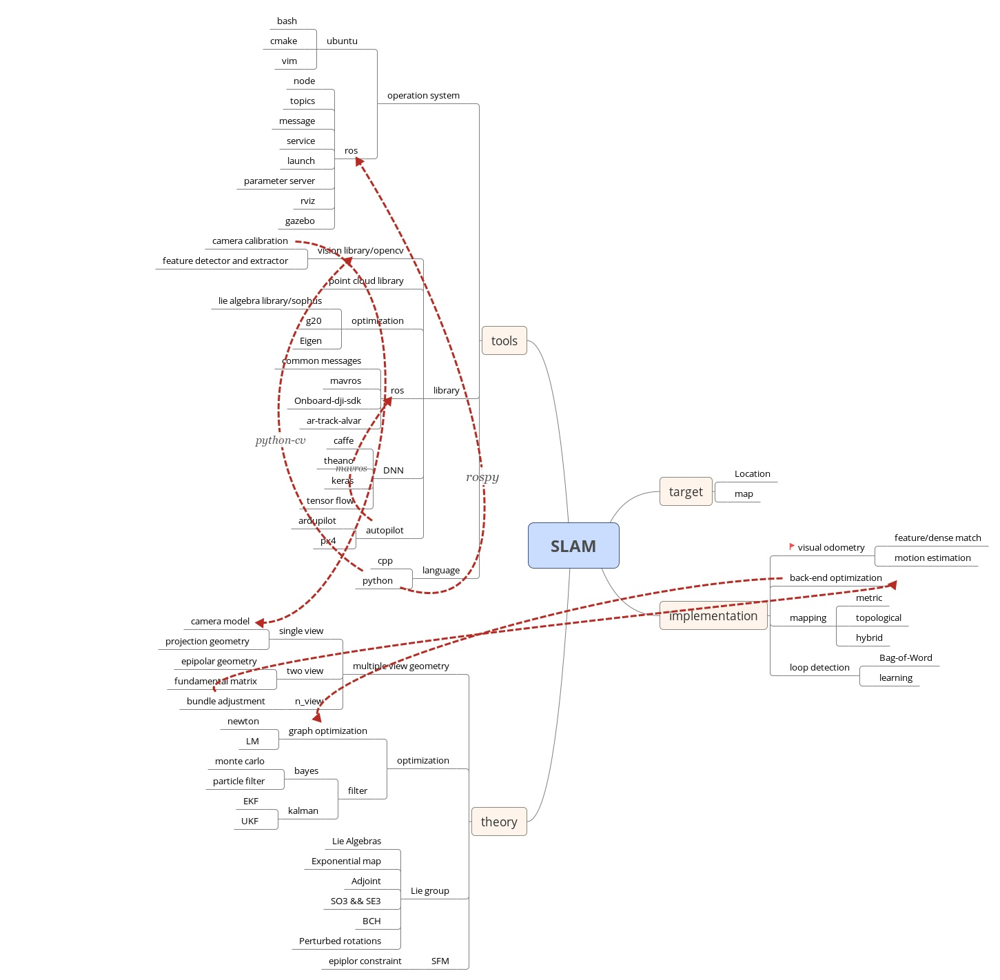

# SLAM-Doc

## OpenSource-SLAM

| Project | Sensor | Link |
| ------------  | -------- | --- |
| [MonoSLAM](https://github.com/hanmekim/SceneLib2) | monocular | https://github.com/hanmekim/SceneLib2 |  |
| [PTAM](https://www.robots.ox.ac.uk/~gk/PTAM) | monocular | http://wiki.ros.org/ethzasl_ptam/ptam/ |
| [ORB-SLAM](http://webdiis.unizar.es/~raulmur/orbslam) | monocular | http://webdiis.unizar.es/~raulmur/orbslam |
| [ORB-SLAM2](https://github.com/raulmur/ORB_SLAM2) | monocular | http://wiki.ros.org/orb_slam2_ros https://github.com/ethz-asl/orb_slam_2_ros |
| [LSD-SLAM](https://github.com/tum-vision/lsd_slam) | monocular | https://github.com/tum-vision/lsd_slam |
| [SVO](https://github.com/uzh-rpg/rpg_svo) | monocular | https://github.com/uzh-rpg/rpg_svo |
| [DSO](https://github.com/JakobEngel/dso) | monocular | https://github.com/JakobEngel/dso |
| [DTSLAM](https://github.com/plumonito/dtslam) | monocular | https://github.com/plumonito/dtslam |
| [REBVO](https://github.com/JuanTarrio/rebvo) | monocular | https://github.com/JuanTarrio/rebvo | 
| [COSLAM](http://drone.sjtu.edu.cn/dpzou/project/coslam.php) | multi-camera | http://drone.sjtu.edu.cn/dpzou/project/coslam.php | 
| [OKVIS](https://github.com/ethz-asl/okvis) | multi-camera+IMU | https://github.com/ethz-asl/okvis | 
| [ROVIO](https://github.com/ethz-asl/rovio) | multi-camera+IMU | https://github.com/ethz-asl/rovio | 
| [RTAB-MAP](https://github.com/introlab/rtabmap) | multi-camera/RGB-D | http://wiki.ros.org/rtabmap_ros |
| [DTAM](https://github.com/anuranbaka/OpenDTAM) | RGB-D | https://github.com/anuranbaka/OpenDTAM | 
| [DVO](https://github.com/tum-vision/dvo_slam) | RGB-D | https://github.com/tum-vision/dvo_slam |
| [RGBD-SLAM-V2](https://github.com/felixendres/rgbdslam_v2) | RGB-D | https://github.com/felixendres/rgbdslam_v2 |
| [Elastic Fusion](https://github.com/mp3guy/ElasticFusion) | RGB-D | https://github.com/mp3guy/ElasticFusion | 
| [RBPF-SLAM](http://www.mrpt.org/tutorials/slam-algorithms/rbpf-slam_algorithms/) | laser |http://www.mrpt.org/tutorials/slam-algorithms/rbpf-slam_algorithms/ |
| [Hector SLAM](https://wiki.ros.org/hector_slam) | laser | https://wiki.ros.org/hector_slam |
| [GMapping](https://wiki.ros.org/gmapping) | laser+odom | https://wiki.ros.org/gmapping |
| [Cartographer](https://github.com/googlecartographer/cartographer) | laser+imu | http://wiki.ros.org/cartographer |

[openslam](https://openslam-org.github.io/)

## Calibration

* [Calibrate](calibrate.md)
  * [Kalibr](kalibr.md)
  
## Visual slam

### bundle adjustment